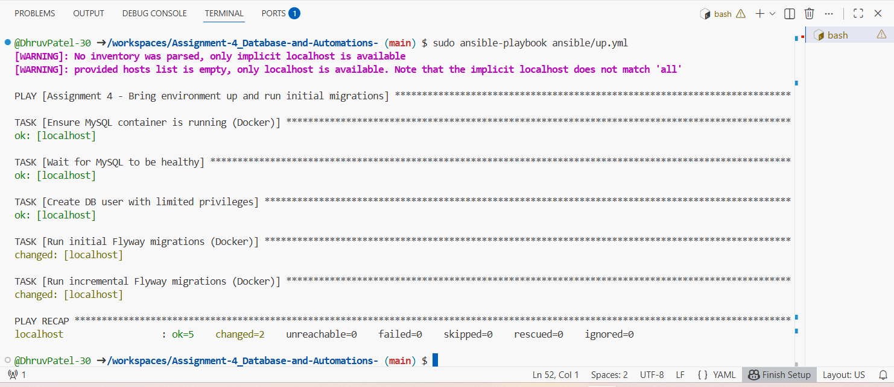
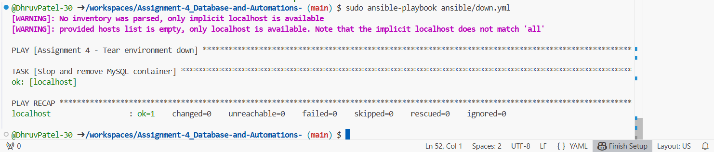
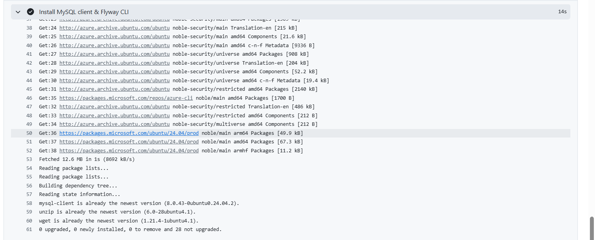
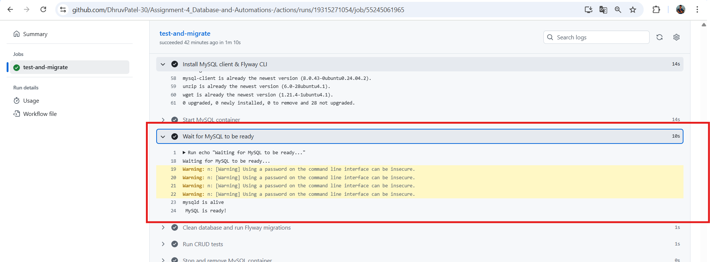
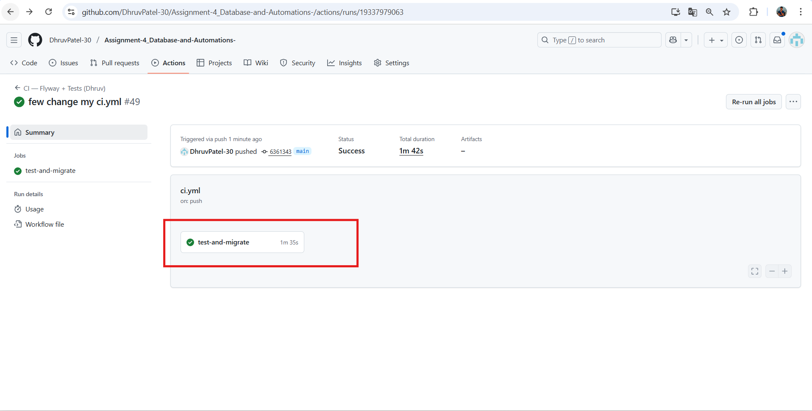

# Assignment 4 – Database Migrations with Flyway, Ansible & CI/CD  
**Course:** PROG8850 – Database Automation  
**Name:** Dhruv Patel (9062297)  
---
This project automates database version control using **Flyway**, **Ansible**, and **GitHub Actions CI/CD**.  
It provisions a MySQL environment, applies schema migrations, and validates them using **pytest CRUD tests**.
---

# Provision MySQL Environment Locally with Ansible:
# 1. Run the Ansible playbook to start the MySQL container, create the database, and apply initial migrations:
    sudo ansible-playbook ansible/up.yml

# 2. Install dependencies 
    pip install -r requirements.txt

# 3. Run the automated database tests:
    pytest tests/test_subscribers.py -v 
    Tests include:

    CREATE: Insert a new subscriber
    READ: Retrieve subscriber details
    UPDATE: Modify subscriber record
    DELETE: Remove subscriber from table

# 4.Tear Down Environment
    sudo ansible-playbook ansible/down.yml

## Continuous Integration (CI/CD) – GitHub Actions

# 1.Set up Python and MySQL service
 Install Python dependencies
          python -m pip install --upgrade pip
          pip install -r requirements.txt
          pip install pytest

# 2 Install MySQL client and Flyway CLI
         sudo apt-get update
          sudo apt-get install -y mysql-client unzip wget
          wget -q https://repo1.maven.org/maven2/org/flywaydb/flyway-commandline/10.22.0/flyway-commandline-10.22.0-linux-x64.tar.gz
          tar -xzf flyway-commandline-10.22.0-linux-x64.tar.gz
          sudo ln -s $(pwd)/flyway-10.22.0/flyway /usr/local/bin/flyway
          

# 3 Start MySQL container
          docker run -d \
            --name a4-mysql-dhruv \
            -e MYSQL_ROOT_PASSWORD=DhruvPass!9062297 \
            -e MYSQL_DATABASE=subscriptions_dhruv \
            -p 3307:3306 \
            mysql:8

# 4 Wait until MySQL is ready
     

# 5 Clean DB and run Flyway migrations (initial + incremental)

      
# 6 Run pytest tests
    pytest -q tests/test_subscribers.py
    

# 7 Stop and remove MySQL container
    docker rm -f a4-mysql-dhruv || true

# 8 Pipeline complete message
    " CI/CD pipeline complete for commit ${{ github.sha }}"
    

 # CI_CD Run Successfully:
    

